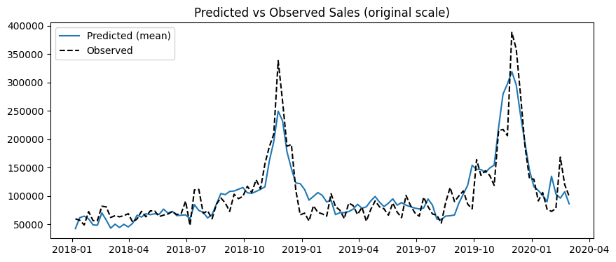

# Marketing Mix Model — Sample Media Spends Dataset

A Bayesian marketing mix model (MMM) built to decompose retail sales across five media channels, quantify channel-level contribution, and identify carryover and diminishing-returns effects.

## Business Question

Given weekly media activity across five channels (Paid Views, Google, Email, Facebook, and Affiliate impressions), how much of total sales can be attributed to each channel, and where are the biggest opportunities for reallocation?

## Data

- **Source:** [Sample Media Spends Data](https://www.kaggle.com/datasets/yugagrawal95/sample-media-spends-data) (Kaggle)
- **Granularity:** Weekly, filtered to a single division for this analysis
- **Period:** ~113 weeks (Jan 2018 – Feb 2020)
- **Note:** This dataset reports channel *impressions*, not dollar spend — see Limitations below.

## Methodology

Built with [PyMC-Marketing](https://www.pymc-marketing.io/), using a Bayesian linear model with:

- **Geometric adstock** — models the carryover effect of media activity into future weeks (e.g., an ad seen this week can still influence sales two weeks later)
- **Logistic saturation** — models diminishing returns as channel activity increases
- **Yearly seasonality** (Fourier terms) — captures recurring seasonal demand patterns
- **MCMC sampling** (NUTS, 4 chains) via PyMC — all parameters converged cleanly (r-hat ≈ 1.00 across the board)

## Key Results

**Model fit:** Predicted sales closely track observed sales across the full 2-year period, including both major seasonal peaks (Nov 2018, Nov 2019). The model slightly underestimates peak height, consistent with saturation effects and/or a missing holiday/promotional control variable — a natural next step.

*The gap between predicted (blue) and observed (dashed black) sales is most visible at the two seasonal peaks, where the model consistently underpredicts the height of the surge — the model captures timing well but compresses magnitude at the extremes.*

**Channel contribution (total, original scale):**

| Channel | Total Sales Contribution |
|---|---|
| Email_Impressions | ~$7.0M |
| Google_Impressions | ~$4.2M |
| Facebook_Impressions | ~$2.6M |
| Affiliate_Impressions | ~$1.8M |
| Paid_Views | ~$0.16M |

Email drove the largest absolute share of attributed sales (~34% of total media-attributed sales).

**Efficiency (contribution per unit of channel activity):**

| Channel | Total Contribution | Total Activity (Impressions) | Contribution per Impression |
|---|---|---|---|
| Affiliate_Impressions | $1,822,317 | lower volume | **2.0446** |
| Email_Impressions | $6,995,929 | high volume | 0.1590 |
| Paid_Views | $160,847 | lowest volume | 0.1515 |
| Facebook_Impressions | $2,608,429 | high volume | 0.1430 |
| Google_Impressions | $4,179,982 | highest volume | 0.0754 |

Affiliate impressions show a dramatically higher contribution-per-impression ratio (2.04) than any other channel — over an order of magnitude above the rest (0.07–0.16). Read alongside the total contribution table, this produces two different rankings depending on the question asked: Email leads on **total sales driven**, while Affiliate leads on **contribution per impression**. This divergence is very likely a **unit-comparability artifact** rather than a true efficiency signal — see Limitations.

## Limitations

- **Impressions ≠ spend.** This dataset provides impression counts, not dollar cost per channel. An "impression" is not a standardized unit of intent or cost across channel types (e.g., an affiliate impression is a structurally rarer, higher-intent event than a Facebook ad impression). Contribution-per-impression ratios are therefore **not directly comparable across channels** and should not be read as true ROI/ROAS. A cleaner efficiency comparison would require cost-per-channel data.
- **Peak underestimation.** The model slightly underpredicts sales at seasonal peaks, suggesting a missing control variable (e.g., a holiday or promotional flag) that could improve fit.
- **Single division.** This analysis filters to one division for simplicity; a full multi-division hierarchical model was out of scope here but is a natural extension.

## Next Steps

- Add a holiday/promotional control variable to improve peak-period fit
- Extend to a spend-based dataset to compute true ROAS and run budget reallocation scenarios
- Build a multi-division hierarchical model

## Tools

Python, PyMC-Marketing, ArviZ, pandas, matplotlib
